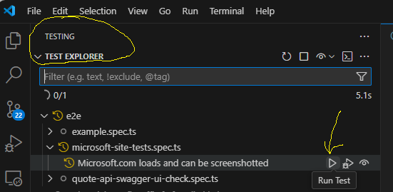
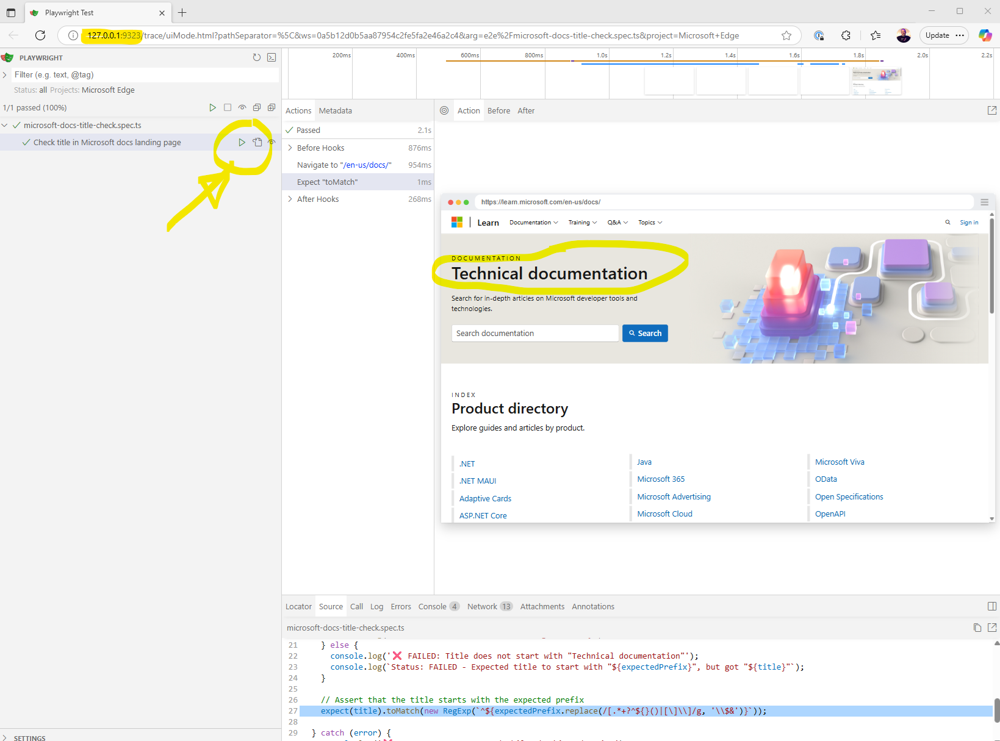
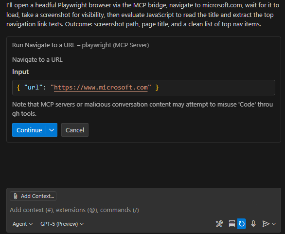
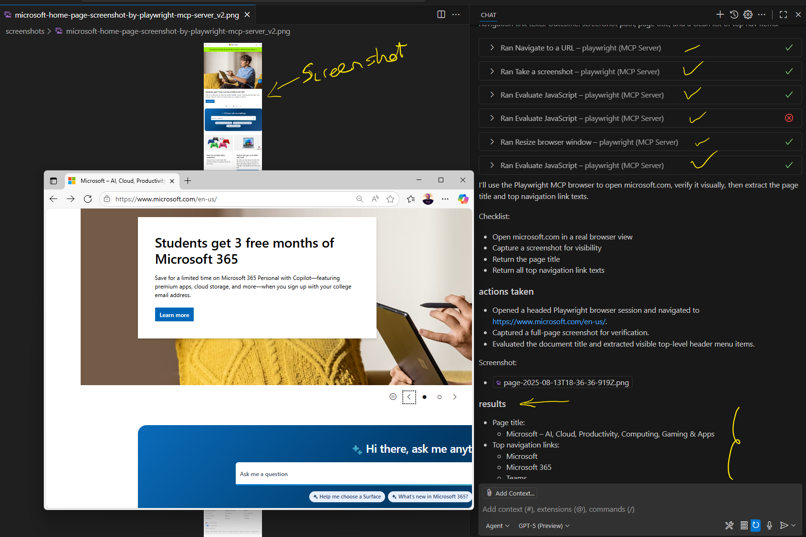
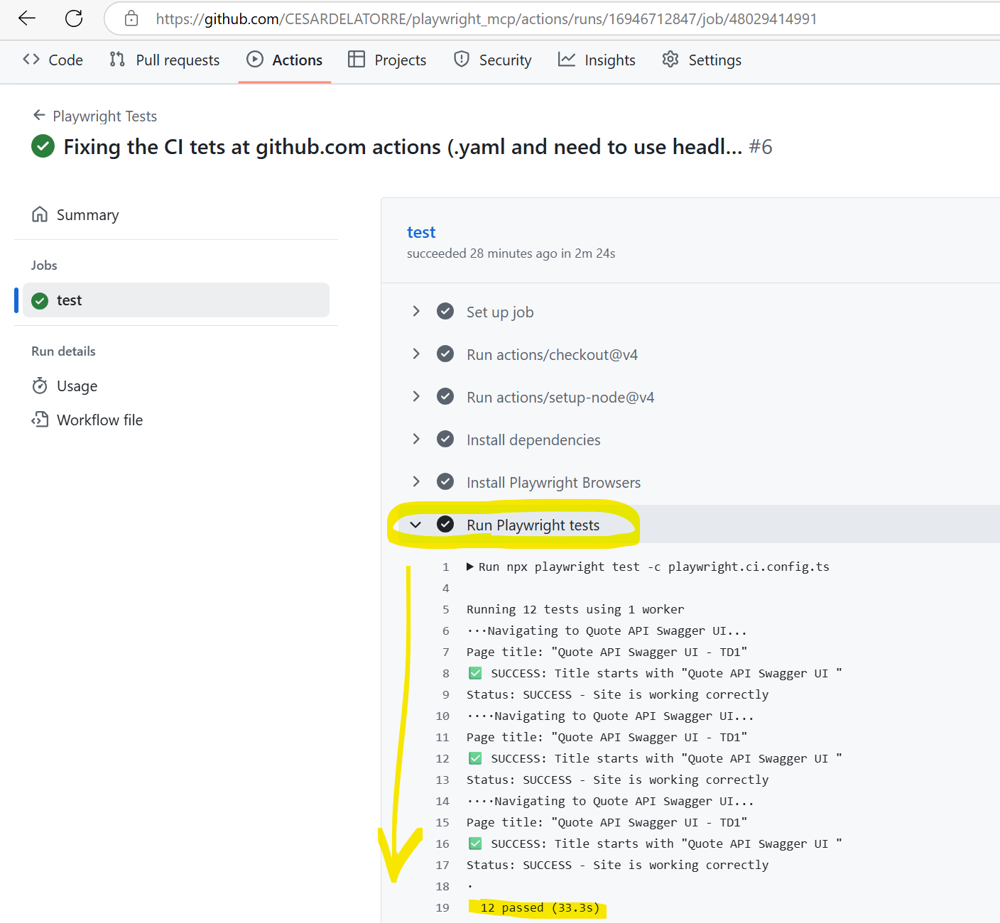
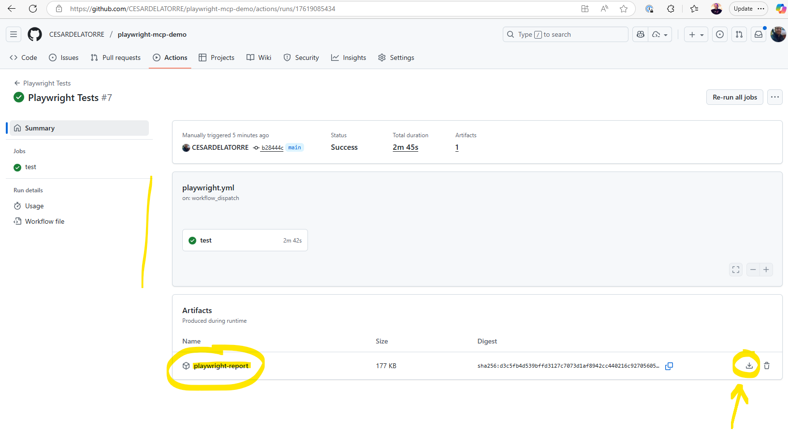

# Testing web apps with "PlayWright" and "Playwright MCP server"

## Project Summary

This project demonstrates the integration of Playwright with MCP and usage from VS Code GHCP and GH Actions.

# Using "plain" Playwright without using its MCP server

Let's see how to use the "plain" Playwright in VS Code (still without its MCP server)

## 1. Install Playwright (for running tests)

For VS Code, I installed it by installing the Playwright VS Code extension:
https://playwright.dev/docs/getting-started-vscode

You can also follow this: https://playwright.dev/docs/intro

**Important note:**

**For simply running Playwright Test specs, you just use the Playwright CLI or Playwright VS Code extension for running those tests.
In addition to that, you can also use the Playwrigth MCP server for agent-driven browser automation using GitHub CoPilot. 
**

For instance, for just simply running a test you can do it with the CLI like the following:

```
npx playwright test e2e/microsoft-site-tests.spec.ts --project='Microsoft Edge' --reporter=line
```


Or with the GH Extension pressing the button:


Or running the Test in Playwright UI Mode:
```
npx playwright test e2e/microsoft-docs-title-check.spec.ts --ui --project='Microsoft Edge' --ui-host=127.0.0.1 --ui-port=9323
```




# Uing Playwright MCP server

## 2. Install Playwright MCP server

Add the following MCP config file to your the .vscode/mcp.json file.

```json
{
  "servers": {
    "playwright": {
      "command": "npx",
      "args": [
        "@playwright/mcp@latest",
        "--browser=msedge"
      ]
    }
  }
}
```

## 3 Test mcp-playwrightw with example prompts:

User input:
```text
Use the Playwright MCP server to go to https://www.microsoft.com and return the page then create a screenshot of it and put it in the /demo-screenshots folder with the file name as microsoft-home-page-screenshot-by-playwright-mcp-server.png
```

```text
Use the Playwright MCP server to go to https://www.microsoft.com, see it in the browser and return the page title and all top navigation link texts in the chat output
```







# Running the Playwright tests triggered by CI with Actions in Github.com

This is configured with the [.github/workflows/playwright.yml](.github/workflows/playwright.yml) yaml file.

I'm using a different playwright config with the [playwright.ci.config.ts](/playwright.ci.config.ts) file so it's running the tests "headless" with no visual browser, otherwise, you get errors in the CI tests.

Show any of the previous executions triggered when there was a code commit/push to the repo.
Open any previous execution, then open the section “Run Playwright tests” to see the tests passed.



You can also trigger it manually since it supports a manual trigger via workflow_dispatch in playwright.yml


OPTIONAL: Show the Playwright Report downloading the .zip file and opening the HTML file.


